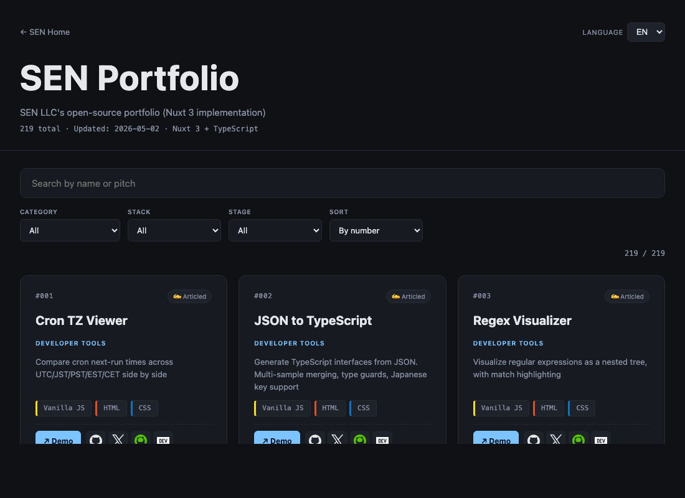

# portfolio-app-nuxt

[](https://sen.ltd/portfolio/portfolio-app-nuxt/)

SEN Portfolio ブラウザの **Nuxt 3 実装**。Nitro サーバーエンジンと Vue 3 Composition API で構成した、比較シリーズ第 5 弾。

**Live demo**: https://sen.ltd/portfolio/portfolio-app-nuxt/



## バンドルサイズ比較（更新）

| 実装 | main JS | gzip | 対 React |
|---|---|---|---|
| React 18 (021) | 151.01 kB | 48.84 kB | — |
| Vue 3 (022) | 73.65 kB | 28.76 kB | −41% |
| Svelte 5 (023) | 49.78 kB | 18.92 kB | −61% |
| SolidJS (024) | 21.97 kB | 8.33 kB | −83% |
| **Nuxt 3 (025)** | **138.96 kB** | **52.01 kB** | **+6%** |

Nuxt 3 は Vue 3 のスーパーセットであり、Nitro・auto-imports・レイヤーシステム等のフル装備を同梱するため、今回の SPA モードでもバンドルが React より若干大きくなっています。本格的な SSR/SSG ユースケースでは、このオーバーヘッドをキャッシュ・プリレンダリング・CDN エッジでほぼ相殺できます。

## 共通コード

`src/types.ts`, `src/filter.ts`, `src/data.ts`, `src/style.css`, `tests/filter.test.ts` は他の実装と byte-identical。差分は `app.vue` と `src/i18n.ts`（framework 名のみ差分）。

## Nuxt 独自のポイント

### Nitro がサーバーとビルドの両方を担う
Solid/React では Vite のカスタムプラグインでローカル `/data.json` を配信していましたが、Nuxt では `server/routes/data.json.ts` を置くだけで Nitro が同等のルートを自動的に処理します。コンフィグをゼロにしながらサーバー側のロジックを TypeScript で書けるのが大きな違いです。

### `ssr: false` でも `nuxt generate` が効く
`ssr: false` と `nuxt generate` を組み合わせると、Nuxt は SPA 向けの `/index.html` / `/200.html` / `/404.html` を静的に書き出します。Vite + React/Solid とほぼ同じ配信成果物でありながら、将来 `ssr: true` に切り替えた瞬間に SSR/ハイドレーションが有効になるアーキテクチャを維持できます。

### Auto-imports で `ref` / `computed` のインポートが不要
Vue 3 では `import { ref, computed } from 'vue'` が必要ですが、Nuxt の auto-imports が `app.vue` 内の `ref()`・`computed()`・`watch()` 等をビルド時に自動解決します。コード量は若干減り、インポート行の抜け漏れによるビルドエラーも起きません。一方でエディタの補完が効くよう `.nuxt/types/` の型を `nuxt prepare` で生成しておくことが推奨されます。

### `useHead` / ルーターが最初からバンドル済み
Nuxt は `@unhead/vue` や `vue-router` をバンドルに含めるため、SPA 単体（Vite + Vue）より初期ペイロードが増えます。今回の比較では Vue 3 ポート（28.76 kB）に対して Nuxt 3 は 52.01 kB と約 23 kB 増えていますが、その差分のほとんどが Nuxt の基盤機能です。フル機能フレームワークとしてのトレードオフを数値で確認できるのが、このシリーズの面白さです。

## ローカル起動

```sh
npm install
npm run dev
# → http://localhost:3000/portfolio/portfolio-app-nuxt/
```

## テスト

```sh
npm test
```

14 vitest ケース（共有の `filter.ts` を node environment で実行）。

## ライセンス

MIT. See [LICENSE](./LICENSE).

---

Part of the [SEN portfolio series](https://sen.ltd/portfolio/). Entry 025.
